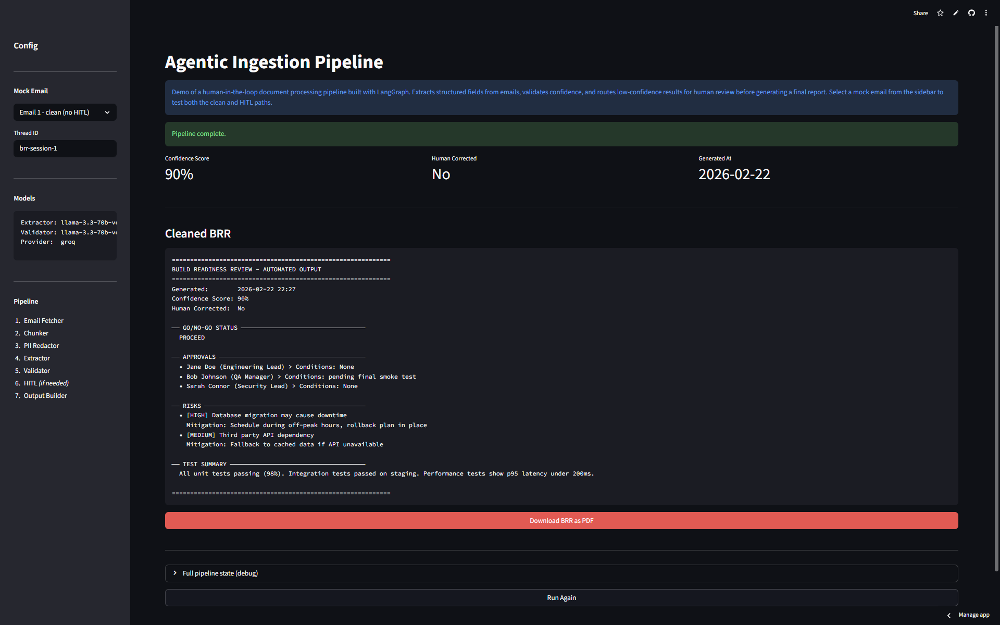
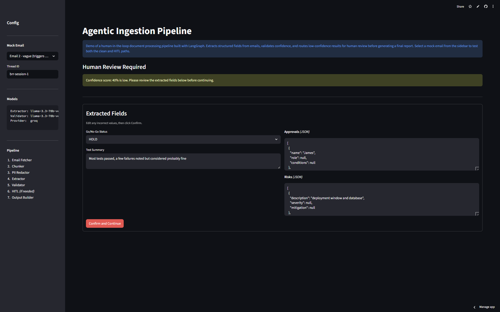
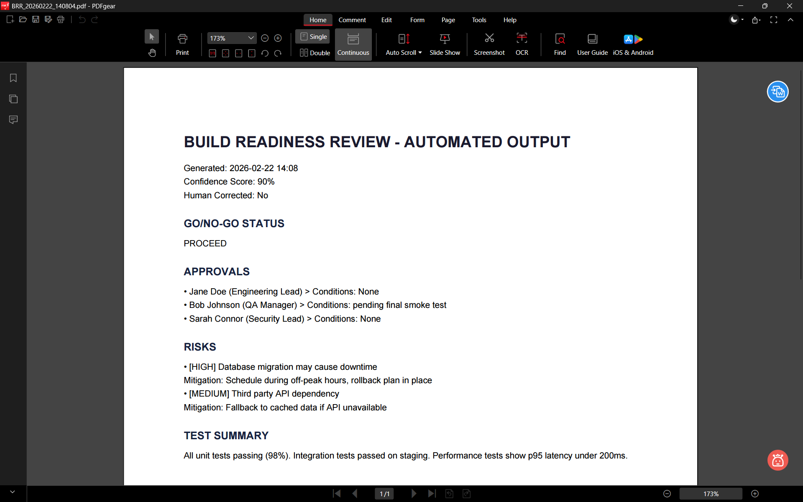

# Agentic Ingestion Pipeline

An agentic document processing pipeline built with LangGraph and Ollama. Reads emails, extracts structured fields using a local LLM, validates the output with a second LLM pass, and routes low-confidence results through a human-in-the-loop review step before generating a final report.

**[Live Demo](https://agentic-ingestion-idp.streamlit.app/)**

**[DEMO]("https://www.loom.com/share/cc559b6392104e6f8d95a5f22ca22bd3")**







---

## Stack

- **LangGraph**: pipeline orchestration and HITL interrupt/resume
- **Ollama + llama3.2**: local LLM, no API keys needed
- **Streamlit**: UI
- **Presidio + regex**: PII redaction before any LLM sees the content
- **reportlab**: PDF export

## Pipeline

```
Email > Chunker > PII Redactor > Extractor > Validator > [HITL if needed] > Output
```

1. **Email Fetcher**: loads from a mock `.txt` file or Gmail (OAuth)
2. **Chunker**: splits text into overlapping chunks
3. **PII Redactor**: strips emails, phone numbers, SSNs before the LLM sees anything
4. **Extractor**: LLM pass 1, pulls structured fields (approvals, risks, go/no-go, test summary)
5. **Validator**: LLM pass 2, scores confidence and flags issues
6. **HITL**: if confidence < 80%, the pipeline pauses and surfaces the extracted fields for human correction
7. **Output Builder**: assembles the final report and exports to PDF

## Running locally

**Prerequisites:** [Ollama](https://ollama.com) running locally with `llama3.2` pulled.

```bash
git clone https://github.com/YOUR_USERNAME/agentic-idp
cd agentic-idp
pip install -r requirements.txt
ollama pull llama3.2
```

Create a `.env` file:

```env
USE_MOCK_DATA=true
MOCK_EMAIL_FILE_NAME=brr_email_002.txt
BRR_EMAIL_SUBJECT_KEYWORD=BRR

LLM_PROVIDER=groq # groq for deployment / ollama for local
GROQ_API_KEY=your_groq_api_key_here

EXTRACTOR_MODEL=llama-3.3-70b-versatile
VALIDATOR_MODEL=llama-3.3-70b-versatile
OLLAMA_BASE_URL=http://localhost:11434

LANGFUSE_PUBLIC_KEY=your_public_key_here
LANGFUSE_SECRET_KEY=your_secret_key_here
LANGFUSE_HOST=https://cloud.langfuse.com
```

```bash
streamlit run main.py
```

Two mock emails are included in `data/mock_emails/`:
- `brr_email_001.txt` - clean, high-confidence, routes straight to output
- `brr_email_002.txt` - vague and incomplete, triggers HITL review

To switch between them, change `MOCK_EMAIL_FILE` in `.env`.
